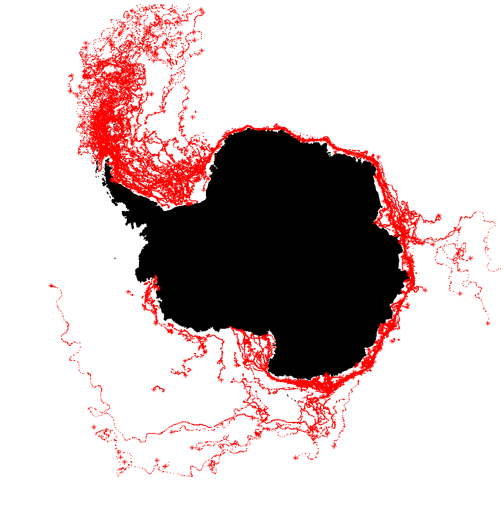

# Iceberg Locations

[](https://github.com/Joel-hanson/Iceberg-locations/actions/workflows/iceberge-tracker.yml)

<p align="center">
  
</p>

> Antarctic large iceberg positions derived from ASCAT and OSCAT-2. All data collected here are from the NASA SCP website

## Overview

This a project which automatically scrapes data from https://www.scp.byu.edu/current_icebergs.html to get the current location of all the large iceberg in the Antarctic, The position is derived from ASCAT and OSCAT-2. The json `iceberg_location.json` contains all the information collected from the page. This JSON is typically updated once or twice a week(as per the updates on the website), typically on Mondays and possibly Fridays. Positions reported here are extracted from near real-time ASCAT and OSCAT-2 data in tandem. Positions reported in the full iceberg database are generated from science data and have been more accurately tracked. The full database is updated only a few times per year which can be accessed from https://www.scp.byu.edu/data/iceberg/database1.html.

> The scheduled task of scraping the website runs every day.

## Requirements

1. Python (3.6, 3.7, 3.8, 3.9)
2. beautifulsoup4 (4.9.3)
3. lxml (4.6.2)

## Get started

Step 1: Install requirements

`pip install -r requirements.txt`

Step 2: Make migration for the models

`python iceberg.py`

Step 3: Go to the link `iceberg_location.json` to see the latest position details of the iceberg.

## JSON Schema

The file `iceberg_location.json` is structured in the format

```json
{
    "$schema": "http://json-schema.org/draft-06/schema#",
    "type": "object",
    "additionalProperties": {
        "type": "array",
        "items": {
            "$ref": "#/definitions/ScriptElement"
        }
    },
    "definitions": {
        "ScriptElement": {
            "type": "object",
            "additionalProperties": false,
            "properties": {
                "iceberg": {
                    "type": "string"
                },
                "recent_observation": {
                    "type": "string"
                },
                "longitude": {
                    "type": "integer"
                },
                "dms_longitude": {
                    "type": "string"
                },
                "dms_lattitude": {
                    "type": "string"
                },
                "lattitude": {
                    "type": "integer"
                }
            },
            "required": [
                "dms_lattitude",
                "dms_longitude",
                "iceberg",
                "lattitude",
                "longitude",
                "recent_observation"
            ],
            "title": "ScriptElement"
        }
    }
}
```

## Example

```json
{
    "02/12/21": [
        {
            "iceberg": "a23a",
            "recent_observation": "02/09/21",
            "longitude": -400.0,
            "dms_longitude": "40 0'W",
            "dms_lattitude": "75 45'S",
            "lattitude": -7545.0
        },
        {
            "iceberg": "a63",
            "recent_observation": "02/09/21",
            "longitude": -5447.0,
            "dms_longitude": "54 47'W",
            "dms_lattitude": "71 41'S",
            "lattitude": -7141.0
        },
        {
            "iceberg": "a64",
            "recent_observation": "02/09/21",
            "longitude": -6038.0,
            "dms_longitude": "60 38'W",
            "dms_lattitude": "69 23'S",
            "lattitude": -6923.0
        },
        ................
```

_OSCAT-2 - Operational users please note: This list cannot possibly contain all potentially hazardous icebergs in Antarctic waters -- Scatterometers such as ASCAT and OSCAT-2 were designed for measuring ocean winds, not icebergs. Scatterometer data is useful for tracking icebergs but is limited. During the Austral summer contrast between ocean and melting icebergs is reduced, which can result in gaps invisibility. Further, as the SCP team is not an operational agency, errors are expected and we cannot be held responsible for omissions or errors in this database. Also, note that the large icebergs tracked here tend to shed smaller iceberg fragments which are serious navigation hazards in nearby areas. Fragments (large and small) can drift substantial distances from their origins._